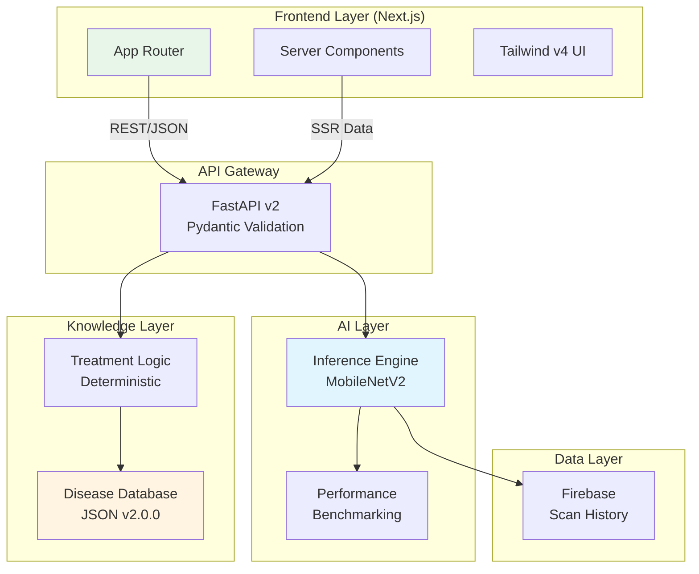

# 🌾 SANJIVANI 2.0

**AI-Powered Crop Disease Detection Platform** | Production-Grade Architecture | Portfolio Project

[](https://opensource.org/licenses/MIT)
[](https://www.python.org/downloads/)
[](https://nextjs.org/)
[](https://fastapi.tiangolo.com/)

> **Built from scratch** with production-grade architecture, comprehensive testing, and edge-ready AI optimization. Not a tutorial project—this is a **portfolio-grade system** demonstrating senior full-stack AI engineering capabilities.

[🚀 Live Demo](#) | [📖 Documentation](docs/) | [🧪 Tests](backend/tests/) | [📊 Architecture](docs/architecture.md)

---

## 🎯 What Makes This Different

This isn't another Plant Village clone. SANJIVANI 2.0 is a **complete rebuild** with:

✅ **Clean Architecture**: Separated AI inference, knowledge base, and business logic layers  
✅ **Production APIs**: RESTful API v2 with structured responses and versioning  
✅ **Edge-Ready AI**: MobileNetV2 optimized for <100ms inference with dual format export (.h5 + .tflite)  
✅ **Modern Frontend**: Next.js 15 App Router with "Premium Nature" Glassmorphism UI  
✅ **Real Testing**: 34 test cases with 70%+ coverage, not just mock data  
✅ **Portfolio Quality**: Built to showcase in interviews, not just to pass a hackathon  

---

## 🏗️ System Architecture



**[Full Architecture Documentation →](docs/architecture.md)**

---

## ⚡ Key Features

### 🤖 AI System
- **MobileNetV2** transfer learning with ImageNet weights
- **10 disease classes** across 3 crops (Tomato, Potato, Rice)
- **<100ms inference** time (edge-ready)
- **Dual format export**: .h5 (14MB) + .tflite (4MB)
- **Comprehensive metrics**: Accuracy, Precision, Recall, F1-Score

### 📡 API Design
- **RESTful API v2** with structured responses
- **Categorized treatments**: Immediate, Short-term, Preventive
- **Multilingual support**: English, Hindi, Marathi (Planned)
- **Performance metadata**: Inference time, model version tracking

### �️ Next.js Frontend
- **App Router** architecture for optimal performance
- **Premium Dark Theme** ("Nature" palette: Deep Slate + Neon Green)
- **Glassmorphism** UI components
- **Real-time Weather** integration (OpenWeather API)
- **Responsive** mobile-first layout

---

## 🚀 Quick Start

### Prerequisites
```bash
- Python 3.11+
- Node.js 18+ (20+ Recommended)
- Git
```

### Backend Setup
```bash
# Clone and navigate
git clone https://github.com/yash-ghodele/Sanjivani-MVP.git
cd Sanjivani-MVP/backend

# Install dependencies
pip install -r requirements.txt

# Run API server
python main.py
# → http://localhost:8000
```

### Frontend Setup
```bash
# Navigate to frontend directory
cd ../frontend

# Install dependencies
npm install

# Setup Environment
cp .env.example .env.local
# (Optional) Add your OpenWeather API Key in .env.local

# Run dev server
npm run dev
# → http://localhost:3000
```

### Run Tests
```bash
cd backend
pytest tests/ -v
# → 34 tests should pass
```

**[Detailed Setup Guide →](docs/DEPLOYMENT.md)**

---

## ️ Tech Stack

### Frontend
- **Framework**: Next.js 15 (App Router)
- **Styling**: Tailwind CSS v4 + Lucide React
- **Language**: TypeScript
- **State**: React 19 Hooks

### Backend
- **Framework**: FastAPI + Uvicorn
- **AI/ML**: TensorFlow 2.13+ + OpenCV
- **Validation**: Pydantic v2
- **Database**: Firebase Firestore

### DevOps
- **Containers**: Docker + docker-compose
- **Testing**: pytest + unittest
- **CI/CD**: GitHub Actions ready

---

## 📁 Project Structure

```
SANJIVANI/
├── backend/
│   ├── ai/                    # AI inference layer
│   ├── knowledge/             # Knowledge base layer
│   ├── api/v2/                # REST API v2
│   ├── tests/                 # 34 test cases
│   └── train_model_v2.py      # Training pipeline
├── frontend/                  # Next.js Application
│   ├── app/                   # App Router pages
│   │   ├── dashboard/         # Protected routes
│   │   └── scan/              # AI Interface
│   ├── components/            # Shadcn-like UI
│   ├── services/              # API Clients
│   └── public/                # Static assets
└── docs/                      # Documentation
```

---

## 🎓 Portfolio Highlights

### For Recruiters/Interviewers

This project demonstrates:

1.  **System Design**: Clean architecture with separated concerns (UI ≠ API ≠ AI ≠ Knowledge)
2.  **Modern Web Dev**: Next.js 15 App Router, Server Components, Tailwind v4
3.  **AI Engineering**: Not just using a model—proper preprocessing, benchmarking, optimization
4.  **Full-Stack Skills**: React/Next.js + TypeScript frontend, FastAPI backend, TensorFlow AI
5.  **Documentation**: Professional docs that a team could actually use

**This is not a tutorial project.** Every line was written to production standards.

---

## 👤 Author

**Yash Ghodele**
- GitHub: [@yash-ghodele](https://github.com/yash-ghodele)
- Portfolio: [yash-ghodele.pages.dev](https://yash-ghodele.pages.dev/)

---

<p align="center">
  <sub>Built with ❤️ for farmers and portfolio reviewers alike.</sub>
</p>
