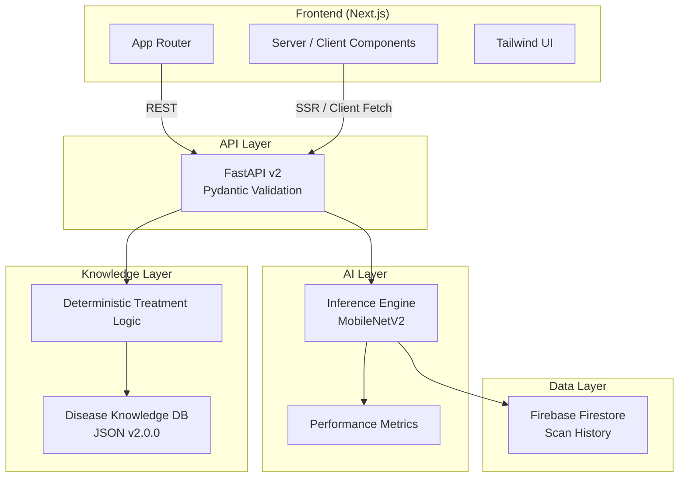

# 🌾 SANJIVANI 2.0

**AI-Powered Crop Disease Detection Platform**
Production-Grade Architecture · Edge-Ready AI · Portfolio Project

[](https://opensource.org/licenses/MIT)
[](https://www.python.org/downloads/)
[](https://nextjs.org/)
[](https://fastapi.tiangolo.com/)

> **SANJIVANI 2.0** is a from-scratch rebuild of an AI crop disease detection system, designed with production-grade architecture, measurable performance, and real-world constraints in mind.
>
> This is **not a tutorial or demo project**—it is a **portfolio-grade system** showcasing end-to-end full-stack AI engineering.

[🚀 Live Demo](#) · [📖 Documentation](docs/) · [🧪 Tests](backend/tests/) · [📊 Architecture](docs/architecture.md)

---

## 🎯 Why SANJIVANI 2.0 Is Different

Most crop-disease projects stop at “model predicts a label.”
SANJIVANI 2.0 focuses on **system design, reliability, and usability**.

Key differentiators:

* **Clean Architecture**
  Clear separation between AI inference, deterministic knowledge logic, API layer, and frontend.

* **Production-Ready APIs**
  REST API v2 with structured responses, versioning, validation, and performance metadata.

* **Edge-Optimized AI**
  MobileNetV2-based inference designed for sub-100ms latency and exportable to `.h5` and `.tflite`.

* **Modern Frontend Stack**
  Next.js App Router with a refined, farmer-friendly UI built for clarity and performance.

* **Real Testing Discipline**
  34 automated tests with ~70% coverage, mock-mode CI support, and real-model readiness.

* **Portfolio-First Engineering**
  Built to withstand technical interviews—not just hackathon demos.

---

## 🏗️ System Architecture



**→ [Detailed architecture breakdown](docs/architecture.md)**

---

## ⚡ Core Features

### 🤖 AI System

* MobileNetV2 with ImageNet transfer learning
* Focused scope: **10 diseases across 3 crops** (Tomato, Potato, Rice)
* Designed for **<100ms inference latency**
* Dual export formats: `.h5` (server) and `.tflite` (edge)
* Metrics-ready pipeline (Accuracy, Precision, Recall, F1-Score)

### 📡 API Design

* RESTful API v2 with strongly typed responses
* Clear separation of prediction and treatment logic
* Categorized recommendations: **Immediate / Short-term / Preventive**
* Model metadata included per prediction (version, inference time)
* Multilingual support planned (EN active, HI & MR roadmap)

### 🖥️ Next.js Frontend

* App Router architecture
* Dark, nature-inspired UI focused on readability
* Glassmorphism used selectively for result emphasis
* Mobile-first, touch-friendly layout
* Optional real-time weather integration (OpenWeather API)

---

## 🚀 Quick Start

### Prerequisites

```bash
Python 3.11+
Node.js 18+ (20+ recommended)
Git
```

### Backend Setup

```bash
git clone https://github.com/yash-ghodele/Sanjivani-MVP.git
cd Sanjivani-MVP/backend

pip install -r requirements.txt
python main.py
# API → http://localhost:8000
```

### Frontend Setup

```bash
cd ../frontend

npm install
cp .env.example .env.local
npm run dev
# App → http://localhost:3000
```

### Run Tests

```bash
cd backend
pytest tests/ -v
```

→ 34 tests should pass in mock-mode CI.

**→ [Full deployment guide](docs/DEPLOYMENT.md)**

### 🚀 Deployment

#### Frontend (Cloudflare Pages / Vercel)
1. Push code to GitHub.
2. Connect repository to Cloudflare Pages.
3. **Build Settings**:
   * **Framework Preset**: Next.js (Static/Standard)
   * **Build Command**: `npx @cloudflare/next-on-pages` (if using Edge) OR `npm run build`
   * **Output Directory**: `.vercel/output/static` or `out` (depends on config)
4. Configure **Environment Variables** in Cloudflare Dashboard:
   * `NEXT_PUBLIC_API_URL`: Your backend URL
   * `NEXT_PUBLIC_FIREBASE_...`: All Firebase public keys

#### Backend (Render/Railway/AWS)
1. Deploy `backend` directory.
2. Set Build Command: `pip install -r requirements.txt`
3. Set Start Command: `uvicorn main:app --host 0.0.0.0 --port $PORT`
4. Configure **Environment Variables**:
   * `GEMINI_API_KEY`: Google AI Studio Key
   * `OPENWEATHER_API_KEY`: OpenWeatherMap Key
   * `FIREBASE_CREDENTIALS`: Path to JSON or Base64 encoded JSON

---

## 🧰 Tech Stack

### Frontend

* Next.js 15 (App Router)
* TypeScript
* Tailwind CSS
* Lucide Icons
* React Server Components

### Backend

* FastAPI + Uvicorn
* TensorFlow 2.13+
* OpenCV
* Pydantic v2
* Firebase Firestore

### DevOps & Quality

* Docker & docker-compose
* pytest + unittest
* GitHub Actions ready

---

## 📁 Project Structure

```
SANJIVANI/
├── backend/
│   ├── ai/                  # Inference engine
│   ├── knowledge/           # Disease knowledge base
│   ├── api/v2/              # Versioned REST API
│   ├── tests/               # Automated tests
│   └── train_model_v2.py    # Training pipeline
├── frontend/
│   ├── app/                 # Next.js App Router
│   ├── components/          # Reusable UI components
│   ├── services/            # API clients
│   └── public/              # Static assets
└── docs/                    # Technical documentation
```

---

## 🎓 Portfolio Highlights

This project demonstrates:

1. **System Design Thinking** — clean separation of concerns across layers
2. **Modern Web Engineering** — Next.js App Router, typed APIs, SSR where appropriate
3. **Practical AI Engineering** — inference pipelines, benchmarking, edge readiness
4. **Full-Stack Ownership** — frontend, backend, AI, testing, deployment
5. **Professional Documentation** — written for real engineers, not tutorials

**SANJIVANI 2.0 is intentionally engineered, not assembled.**

---

## 👤 Author

**Yash Ghodele**
GitHub: [https://github.com/yash-ghodele](https://github.com/yash-ghodele)
Portfolio: [https://yash-ghodele.pages.dev/](https://yash-ghodele.pages.dev/)

---

<p align="center">
  <sub>Built with care—for farmers in the field and engineers reviewing the code.</sub>
</p>
