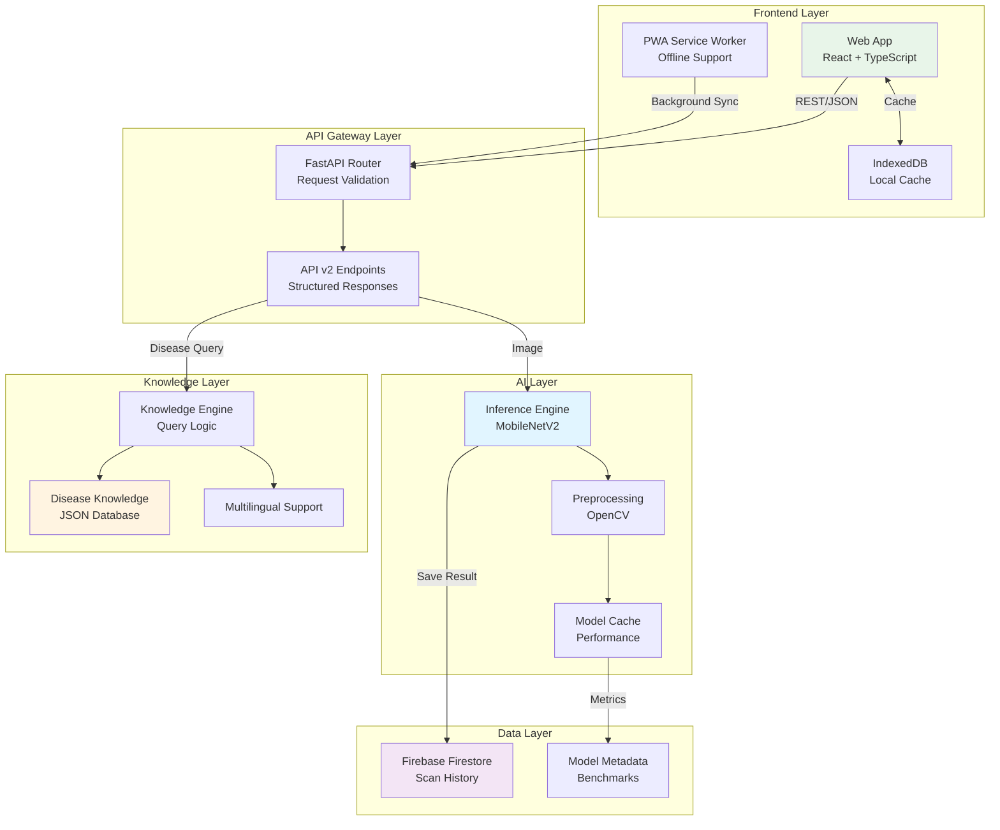

# SANJIVANI 2.0 - System Architecture

## High-Level Architecture



## Layer Responsibilities

### 🎨 Frontend Layer
**Responsibility:** User interface and experience only
- Display results clearly
- Handle user interactions
- Manage offline state
- No business logic
- No AI logic

### 🚪 API Gateway Layer
**Responsibility:** Request routing and validation
- Input validation (Pydantic)
- Error handling
- Rate limiting
- API versioning
- Response formatting

### 🧠 AI Layer
**Responsibility:** Pure inference only
- Image preprocessing
- Model inference
- Performance tracking
- No treatment logic
- No domain knowledge

### 📚 Knowledge Layer
**Responsibility:** Domain expertise and recommendations
- Disease information lookup
- Treatment protocols
- Severity assessment
- Multilingual content
- Deterministic outputs

### 💾 Data Layer
**Responsibility:** Persistence and history
- Scan history storage
- User data
- Model benchmarks
- Analytics data

---

## File Structure (SANJIVANI 2.0)

```
CropGuard/
├── frontend/
│   ├── src/
│   │   ├── components/
│   │   │   ├── scan/
│   │   │   │   ├── ResultCard.tsx          # NEW: Structured result display
│   │   │   │   ├── ActionCard.tsx          # NEW: Recommended actions
│   │   │   │   ├── ConfidenceBar.tsx       # NEW: Visual confidence
│   │   │   │   └── SeverityBadge.tsx       # NEW: Severity indicator
│   │   │   ├── dashboard/
│   │   │   └── ui/
│   │   ├── hooks/
│   │   │   ├── useOfflineSync.ts           # NEW: Offline sync
│   │   │   └── useModelMetrics.ts          # NEW: Model info
│   │   ├── lib/
│   │   │   ├── offline-queue.ts            # NEW: Scan queue
│   │   │   └── api-client.ts               # MODIFY: API v2
│   │   └── pages/
│   │       └── Scan.tsx                    # MODIFY: New response
│   ├── public/
│   │   ├── service-worker.js               # NEW: PWA
│   │   └── manifest.json                   # NEW: PWA config
│   └── package.json
│
├── backend/
│   ├── ai/
│   │   ├── __init__.py
│   │   ├── inference_engine.py             # NEW: Isolated inference
│   │   ├── model_evaluator.py              # NEW: Benchmarking
│   │   ├── dataset_config.py               # NEW: Focused scope
│   │   └── preprocessing.py                # NEW: Image pipeline
│   ├── knowledge/
│   │   ├── __init__.py
│   │   ├── disease_knowledge.json          # NEW: Versioned DB
│   │   └── knowledge_engine.py             # NEW: Query logic
│   ├── schemas/
│   │   ├── __init__.py
│   │   ├── prediction.py                   # NEW: Response schemas
│   │   └── metrics.py                      # NEW: Benchmark schemas
│   ├── api/
│   │   ├── __init__.py
│   │   ├── v2/
│   │   │   ├── predict.py                  # NEW: v2 endpoint
│   │   │   ├── metrics.py                  # NEW: Model metrics
│   │   │   └── health.py                   # NEW: Health check
│   ├── models/
│   │   ├── plant_disease_v2.h5             # NEW: Retrained model
│   │   ├── plant_disease_v2.tflite         # NEW: Edge version
│   │   ├── model_metadata.json             # NEW: Benchmarks
│   │   └── class_names.json                # MODIFY: New classes
│   ├── main.py                             # MODIFY: New structure
│   ├── train_model_v2.py                   # NEW: Improved training
│   └── requirements.txt                    # MODIFY: Add dependencies
│
├── docs/
│   ├── ARCHITECTURE.md                     # NEW: System design
│   ├── AI_PIPELINE.md                      # NEW: ML documentation
│   ├── API.md                              # NEW: API reference
│   └── DEPLOYMENT.md                       # NEW: Deploy guide
│
├── BENCHMARKS.md                           # NEW: Performance metrics
├── README.md                               # MODIFY: Portfolio-grade
└── docker-compose.yml                      # MODIFY: Updated services
```

---

## Data Flow

### 1. Prediction Request Flow

```
User → Camera → Image Capture
    ↓
Frontend → FormData
    ↓
API Gateway → Validate Request
    ↓
Inference Engine → Preprocess Image
    ↓
Model → Classification
    ↓
Knowledge Engine → Map to Disease Info
    ↓
API Response → Structured JSON
    ↓
Frontend → Render Result Card
```

### 2. Offline Flow

```
User Scans → Check Network
    ↓ (Offline)
Queue Scan → IndexedDB
    ↓
Show Queued State
    ↓ (Online)
Background Sync → Process Queue
    ↓
Update UI → Show Results
```

---

## Technology Choices Rationale

| Technology | Why? | Alternative Considered |
|------------|------|----------------------|
| **MobileNetV2** | Edge-ready, proven, 14MB model size, fast inference | EfficientNet (larger), ResNet (slower) |
| **FastAPI** | Type safety, auto docs, async, Python ML ecosystem | Flask (no async), Django (overkill) |
| **Firebase** | Real-time, scalable, offline support, easy auth | PostgreSQL (harder offline), MongoDB |
| **TypeScript** | Type safety, better DX, catches errors early | JavaScript (no types) |
| **PWA** | Offline-first, installable, no app store needed | Native app (2x dev effort) |
| **TensorFlow** | Industry standard, great docs, .tflite export | PyTorch (harder mobile) |

---

## Success Metrics

| Metric | Target | Current | Status |
|--------|--------|---------|--------|
| Model Accuracy | >90% | TBD | 🟡 Pending |
| Inference Time | <100ms | ~1000ms (mock) | 🔴 Needs work |
| Model Size | <20MB | TBD | 🟡 Pending |
| Offline Support | Full PWA | None | 🔴 Not started |
| API Response Time | <200ms | ~500ms | 🟡 Acceptable |
| Code Coverage | >70% | 0% | 🔴 No tests |

---

*This architecture separates concerns, ensures testability, and positions SANJIVANI 2.0 as a production-grade system worthy of portfolio presentation.*
